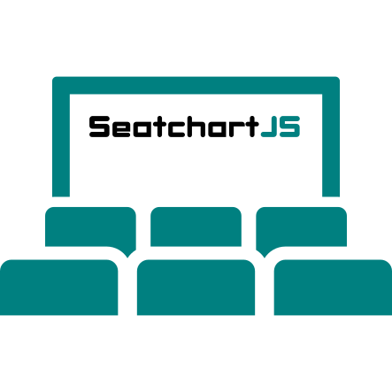

<center>
    
</center>

# Usage

First of all link the library along with the stylesheet and the script that generates the seatchart.

``` html
<link rel="stylesheet" href="/path/to/seatchart.css">
<script type="text/javascript" src="/path/to/seatchart.js"></script>

<script>
    // Reserved and disabled seats are indexed
    // from left to right by starting from 0.
    // Given the seatmap as a 2D array and an index [R, C]
    // the following values can obtained as follow:
    // I = cols * R + C
    var map = {
        rows: 9,
        cols: 9,
        // e.g. Reserved Seat { Row: 1 (starts from 0), Col: 2 } = 9 * 1 + 2 = 11
        reserved: [1, 2, 3, 5, 6, 7, 9, 10, 11, 12, 14, 15, 16, 17, 18, 19, 20, 21],
        disabled: [0, 8],
        disabledRows: [4],
        disabledCols: [4]
    };

    var types = [
        { type: "regular", color: "orange", price: 10, selected: [23, 24] },
        { type: "reduced", color: "#af0000", price: 7.5, selected: [25, 26] },
        { type: "military", color: "red", price: 7 }
    ];

    var sc = new SeatchartJS(map, types);
    sc.setAssetsSrc("/path/to/assets");

    // (1) Create functions
    sc.createMap("map-container");
    sc.createLegend("legend-container"); // optional
    sc.createShoppingCart("shoppingCart-container"); // optional
</script>
```

Then in your web page body create three containers that are going to contain the three elements: seat map, legend and shopping cart. Their id needs to be the same passed to the create functions (1), in your script.

``` html
<div id="map-container"></div>
<div id="legend-container"></div>
<div id="shoppingCart-container"></div>
```

Enjoy the result.

## [Demo](http://omarmahili.github.io/SeatchartJS/index.html#demo)

<div id="demo"></div>

## Development

This library is still in development. It can already be used with websockets and it has some nice features like gap detection. <br />
But things may change a little bit in the future, so give a look to the TODO list below. <br />
If you want to help in the development of this library please open a PR on github, while if you find any problem open an issue. <br />

- [x] Gap detection
- [x] Get/set of a seat after creation (key feature for websockets support)
- [ ] Update jsdoc and docdash
- [ ] Add search bar to documentation
- [ ] Improve documentation home page
- [ ] Remove long press feature on a seat
- [ ] Hide/show sound button
- [ ] Decrease access to the DOM (e.g. getSeatName function)
- [ ] Replace current seat indexing with a simple one: an object { row: 10, col: 10 }
- [ ] Add 'static' mode where seat types are defined by default
- [ ] Add themes
- [ ] Add description and examples to README
- [ ] Add choice for different seat names
- [ ] Show a dropdown menu, on click, to select seat type
- [ ] Add multi-language support
- [ ] Remove onAddedSeat/onRemovedSeat and add onChange event
- [ ] Add onClear event and trigger it when all seats are removed
- [ ] Improve shopping cart design
- [ ] Improve legend: remove 'Available' seat from legend, remove 'Your seats' and 'Seats' subtitles
- [ ] Rename SeatchartJS into seatchart.js
- [ ] Rename SeatchartJS class into Seatchart: ```var sc = new Seatchart()```
- [ ] Move docs to seatchart.js.org
- [ ] Create a development branch and follow [Git Flow](https://nvie.com/posts/a-successful-git-branching-model/)
- [ ] Use [Semantic Versioning](https://semver.org/) and release an alpha
- [ ] Use Travis CI and deploy to npm
- [ ] Backend and frontend example with websockets
- [ ] Minified source
- [ ] Roadmap to v1.0.0